# VAGEN: Teaching Vision-Language Models to Build World Models Through Reinforcement Learning

## TL;DR

We introduce **VAGEN**, a reinforcement learning framework that trains vision-language model (VLM) agents to build internal world models through explicit visual state reasoning. By encouraging agents to actively estimate the current state and predict future transitions, our 3B parameter model achieves state-of-the-art results across diverse visual tasks.

---

## Introduction

Vision-Language Models (VLMs) have shown remarkable capabilities in understanding images and following instructions. However, when deployed as agents that must interact with environments over multiple turns, such as browsing the web, controlling robots, or playing games, their performance degrades significantly. Why?

Vision agentic tasks are inherently complex due to the challenges in understanding visual states, which often are **partial and noisy observations**. At each turn, the agent only sees a single screenshot or image, but the true state of the environment requires integrating information across multi-turn interactions. This is fundamentally different from single-turn visual QA, where all necessary information is present in one image.

In this blog post, we introduce **VAGEN** (VLM Agent Training with World Model Reasoning), a framework that explicitly teaches VLM agents to build and maintain internal world models through reinforcement learning.

---

## The Problem: VLM Agents and Partial Observability

### Framing as a POMDP

We formulate multi-turn VLM agent tasks as a **Partially Observable Markov Decision Process (POMDP)**, as illustrated in **Figure&nbsp;1**.

<div align="center">

<br/>
<b>Figure 1.</b> POMDP formulation of multi-turn VLM agentic tasks.
</div>

In a POMDP:

- The agent receives **observations** (images + text prompts) rather than the full environment state
- The true **state** contains information the agent cannot directly see
- The agent must **infer** the underlying state from its observation history

Consider a robot navigation task: the agent sees a first-person view of a hallway, but the full state includes the robot's position on a map, which rooms have been visited, and where the goal is located. A web browsing agent sees the current webpage, but the state includes the backend session, previous pages visited, and form data submitted.

**Current VLMs struggle with this** because they process each turn independently, without maintaining explicit beliefs about the underlying state.

---

## Our Approach: World Modeling with Structured Reasoning

We propose training VLM agents to perform explicit **world modeling** through two complementary reasoning processes:

### 1. State Estimation (Grounding)

> "What is the current state?"

The agent learns to ground its visual observation into a structured state representation. For example:
- In a grid world: "The player is at position (2,3), there's a wall to the north"
- In navigation: "I'm in a bedroom, facing the door, the target is a couch"
- In robot manipulation: "The gripper is above the red cube, which is on the table"

### 2. Transition Modeling (Prediction)

> "What will happen next?"

The agent learns to predict how its actions will change the environment state:
- "If I move right, I'll be at position (3,3)"
- "If I go through the door, I'll enter the living room"
- "If I close the gripper, I'll be holding the red cube"

### The Combined WorldModeling Strategy

We structure the agent's output as:

```
<think>
  <observation>
    [State estimation: what is the current state?]
  </observation>
  [General reasoning...]
  <prediction>
    [Transition modeling: what will happen after my action?]
  </prediction>
</think>
<answer>[executable action]</answer>
```

This structured format serves two purposes:
1. **During training**: We can extract and evaluate the reasoning to provide targeted rewards
2. **During execution**: The explicit reasoning improves action quality by forcing the model to think systematically

---

## Five Reasoning Strategies

We compare five strategies for incorporating reasoning into VLM agents:

| Strategy | Description | Output Format |
|----------|-------------|---------------|
| **NoThink** | Direct action output, no reasoning | `<answer>action</answer>` |
| **FreeThink** | Unconstrained chain-of-thought | `<think>...</think><answer>action</answer>` |
| **StateEstimation** | Only estimate current state | `<think><observation>...</observation></think><answer>action</answer>` |
| **TransitionModeling** | Only predict transitions | `<think><prediction>...</prediction></think><answer>action</answer>` |
| **WorldModeling** | Both estimation + prediction | `<think><observation>...</observation>...<prediction>...</prediction></think><answer>action</answer>` |

---

## Training Algorithm: WorldModeling RL

<div align="center">

<br/>
<b>Figure 2.</b> Overview of the VAGEN training framework.
</div>

### On-Policy Agentic Training

Following the common agentic RL training paradigm, VAGEN employs an **iterative on-policy training** loop that alternates between rollout and policy update:

**Rollout Phase**: The VLM agent interacts with diverse visual environments through multi-turn episodes. At each turn, the agent receives a visual observation, generates structured reasoning and actions, and receives environment feedback. Complete trajectories $(s_0, a_0, r_0, \ldots, s_K, a_K, r_K)$ are collected in a trajectory buffer.

**Training Phase**: The policy is updated using some RL algorithms (PPO, GRPO, etc.) with collected trajectories. 

What distinguishes VAGEN are two key components designed for visual agentic tasks:
### Component 1: WorldModeling Reward (LLM-as-Judge)

<div align="center">
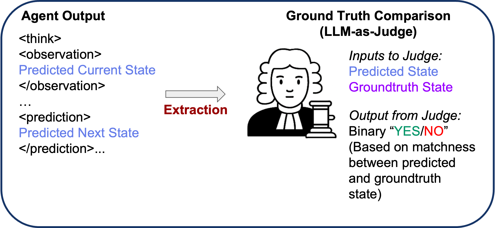
<br/>
<b>Figure 3.</b> The LLM-as-Judge framework for evaluating world modeling quality.
</div>

A key innovation is our **WorldModeling Reward**. Instead of only rewarding task success (which is sparse and delayed), we also reward accurate world modeling at each turn:

1. **Extract** the agent's state estimation and transition predictions from its output
2. **Compare** against ground truth states from the simulator
3. **Score** using an LLM judge that determines if the prediction matches ground truth

This provides dense, intermediate rewards that guide the agent to develop accurate internal representations, even when task rewards are sparse.

### Component 2: Bi-Level GAE for Credit Assignment

<div align="center">
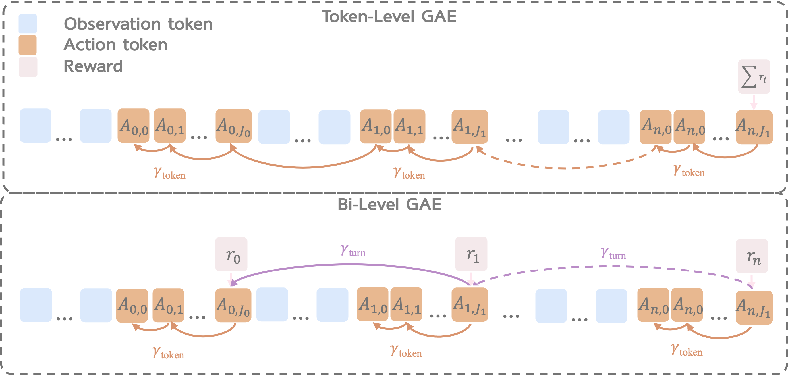
<br/>
<b>Figure 4.</b> Bi-Level GAE decomposes credit assignment into turn-level and token-level components.
</div>

Multi-turn tasks present a credit assignment challenge: which turn contributed to success or failure? Standard GAE treats all tokens equally, but we need to distinguish between:

- **Turn-level credit**: Which turns were pivotal for task success?
- **Token-level credit**: Within each turn, which tokens (reasoning vs. action) mattered most?

**Bi-Level GAE** addresses this by:
1. First computing turn-level advantages using rewards at turn boundaries
2. Then computing token-level advantages within each turn
3. Using separate discount factors for each level

This hierarchical structure provides more precise learning signals for multi-turn reasoning tasks.

---

## Evaluation: Five Diverse Visual Tasks

We evaluate VAGEN across five tasks that require different types of visual reasoning:

### Task Overview

<div align="center">
<table>
<tr>
<td align="center" valign="top">
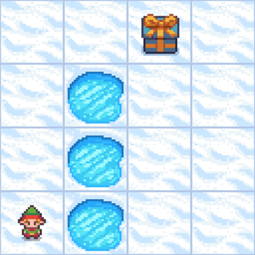<br/>
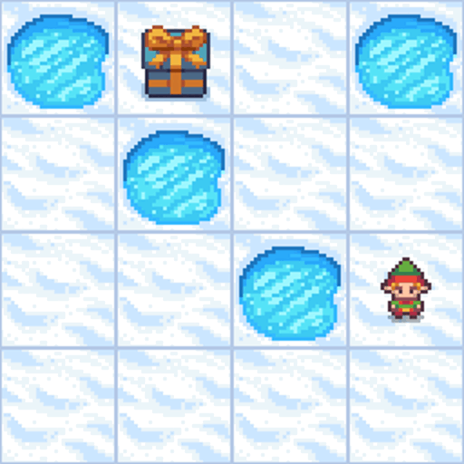<br/>
<b>FrozenLake</b>
</td>
<td align="center" valign="top">
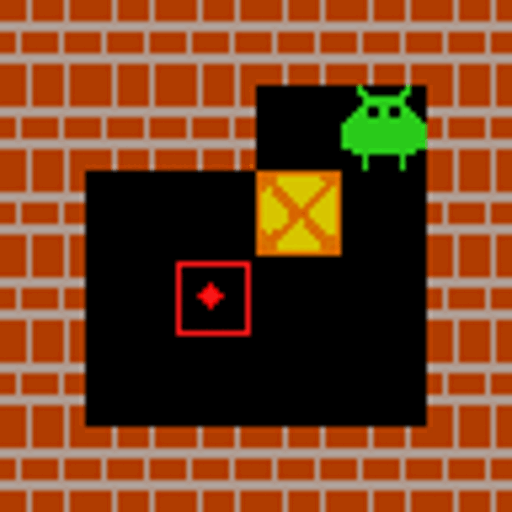<br/>
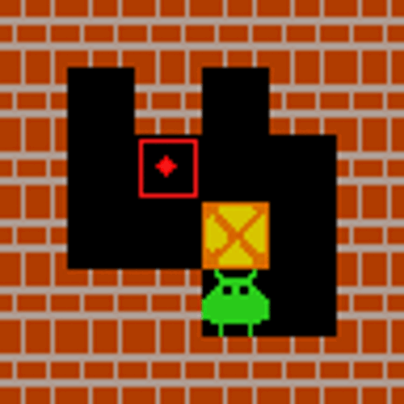<br/>
<b>Sokoban</b>
</td>
<td align="center" valign="top">
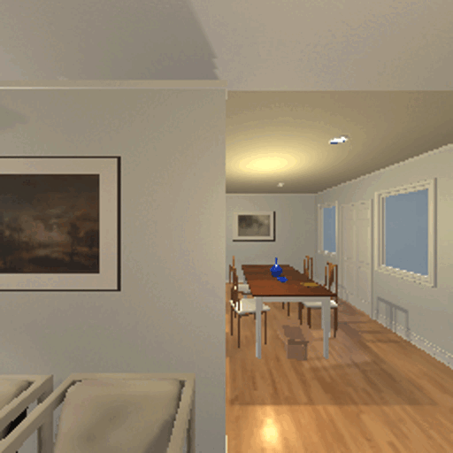<br/>
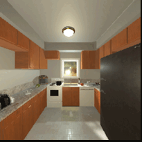<br/>
<b>Navigation</b>
</td>
<td align="center" valign="top">
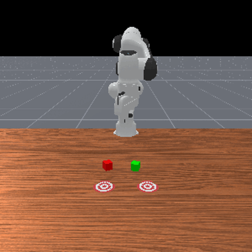<br/>
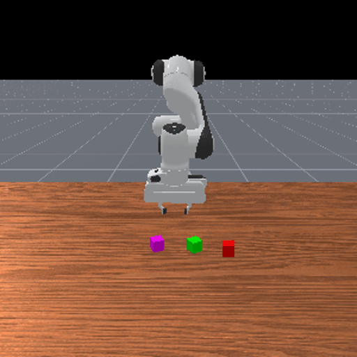<br/>
<b>ManiSkill</b>
</td>
<td align="center" valign="top">
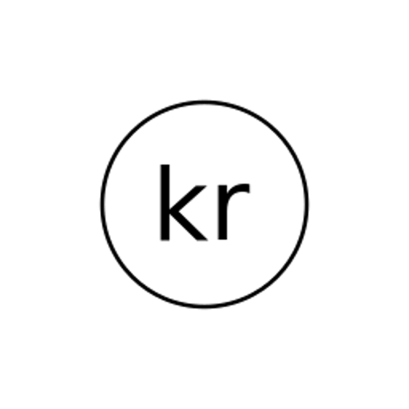<br/>
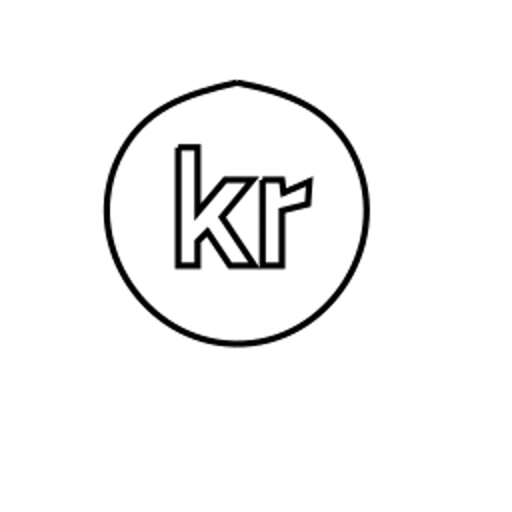<br/>
<b>SVG</b>
</td>
</tr>
</table>
<b>Figure 5.</b> Animated demonstrations of VAGEN agents solving five diverse visual tasks.
</div>

### Task Details

1. **FrozenLake**: Navigate a 4x4 frozen lake grid. The agent must reach the goal while avoiding holes. Requires understanding position and planning safe paths.

2. **Sokoban**: Classic box-pushing puzzle. The agent must push all boxes onto target locations. Requires spatial reasoning and planning multiple moves ahead.

3. **Visual Navigation**: Navigate through realistic 3D indoor environments (AI2-THOR) to find target objects. Requires visual understanding and exploration strategy.

4. **ManiSkill (Robot Manipulation)**: Control a robot arm to pick and place objects. Requires understanding 3D spatial relationships and precise action sequences.

5. **SVG Construction**: Generate SVG code that reconstructs a target image. A unique visual-to-code task requiring iterative refinement across multiple turns.

---

## Results

<div align="center">
<b>Table 1.</b> Main results comparing VAGEN with proprietary VLMs across all five tasks (average scores).
<table style="font-size:14px">
<tr>
<th>Model</th>
<th>Sokoban</th>
<th>FrozenLake</th>
<th>Navigation</th>
<th>PrimitiveSkill</th>
<th>SVG</th>
<th><b>Overall</b></th>
</tr>
<tr><td colspan="7" align="left"><i><b>Open-Source Models</b></i></td></tr>
<tr><td>Qwen2.5-VL-72B</td><td>0.18</td><td>0.44</td><td>0.73</td><td>0.44</td><td>0.76</td><td>0.51</td></tr>
<tr><td>Qwen2.5-VL-7B</td><td>0.13</td><td>0.14</td><td>0.34</td><td>0.19</td><td>0.55</td><td>0.27</td></tr>
<tr><td>Qwen2.5-VL-3B</td><td>0.14</td><td>0.14</td><td>0.24</td><td>0.00</td><td>0.54</td><td>0.21</td></tr>
<tr><td>VLM-R1-3B</td><td>0.13</td><td>0.13</td><td>0.33</td><td>0.00</td><td>0.55</td><td>0.23</td></tr>
<tr><td colspan="7" align="left"><i><b>VAGEN (Ours, Backbone: Qwen2.5-VL-3B)</b></i></td></tr>
<tr><td>FreeThink</td><td>0.57</td><td>0.68</td><td>0.67</td><td>0.66</td><td>0.78</td><td>0.67</td></tr>
<tr><td>NoThink</td><td>0.57</td><td>0.09</td><td>0.00</td><td>0.00</td><td>0.76</td><td>0.28</td></tr>
<tr><td>StateEstimation</td><td>0.56</td><td>0.68</td><td>0.74</td><td>0.00</td><td>0.78</td><td>0.56</td></tr>
<tr><td>TransitionModeling</td><td>0.41</td><td>0.76</td><td>0.62</td><td>0.82</td><td>0.77</td><td>0.68</td></tr>
<tr><td>WorldModeling (VAGEN-Base)</td><td>0.61</td><td>0.71</td><td>0.79</td><td>0.91</td><td>0.78</td><td>0.76</td></tr>
<tr><td>VAGEN-Full</td><td><b>0.79</b></td><td>0.74</td><td>0.81</td><td><b>0.97</b></td><td>0.79</td><td><b>0.82</b></td></tr>
<tr><td colspan="7" align="left"><i><b>RL Baselines</b></i></td></tr>
<tr><td>Vanilla-PPO</td><td>0.18</td><td>0.21</td><td>0.29</td><td>0.00</td><td>0.64</td><td>0.26</td></tr>
<tr><td>GRPO w/ Mask</td><td>0.20</td><td>0.57</td><td><b>0.85</b></td><td>0.25</td><td>0.79</td><td>0.54</td></tr>
<tr><td>Turn-PPO w/ Mask</td><td>0.38</td><td>0.70</td><td>0.81</td><td>0.25</td><td>0.77</td><td>0.55</td></tr>
<tr><td colspan="7" align="left"><i><b>Proprietary Models</b></i></td></tr>
<tr><td>GPT-5</td><td>0.70</td><td>0.77</td><td>0.78</td><td>0.66</td><td>0.85</td><td>0.75</td></tr>
<tr><td>o3</td><td>0.60</td><td>0.78</td><td>0.78</td><td>0.66</td><td>0.82</td><td>0.73</td></tr>
<tr><td>o4-mini</td><td>0.44</td><td><b>0.82</b></td><td>0.75</td><td>0.56</td><td>0.78</td><td>0.67</td></tr>
<tr><td>GPT-4o</td><td>0.43</td><td>0.54</td><td>0.72</td><td>0.50</td><td>0.80</td><td>0.60</td></tr>
<tr><td>Gemini 2.5 Pro</td><td>0.58</td><td>0.78</td><td>0.63</td><td>0.50</td><td>0.86</td><td>0.67</td></tr>
<tr><td>Gemini 2.0</td><td>0.28</td><td>0.61</td><td>0.56</td><td>0.28</td><td>0.84</td><td>0.51</td></tr>
<tr><td>Claude 4.5 Sonnet</td><td>0.31</td><td>0.80</td><td>0.67</td><td>0.53</td><td><b>0.88</b></td><td>0.64</td></tr>
<tr><td>Claude 3.7 Sonnet</td><td>0.25</td><td>0.69</td><td>0.47</td><td>0.44</td><td>0.85</td><td>0.54</td></tr>
</table>
</div>

### Key Findings

**1. VAGEN significantly outperforms proprietary models**

Our 3B parameter model trained with VAGEN achieves 0.82 overall score, compared to:
- GPT-5: 0.75
- Gemini 2.5 Pro: 0.67
- Claude 4.5: 0.62

This demonstrates that explicit world modeling training is more effective than simply scaling model size.

**2. WorldModeling strategy is consistently best**

Across all tasks, the full WorldModeling strategy (combining state estimation and transition modeling) outperforms other reasoning approaches:

| Strategy | Overall Performance |
|----------|---------------------|
| NoThink | Baseline |
| FreeThink | +12% |
| StateEstimation | +18% |
| TransitionModeling | +20% |
| **WorldModeling** | **+25%** |

**3. Both components of WorldModeling RL help**

<div align="center">
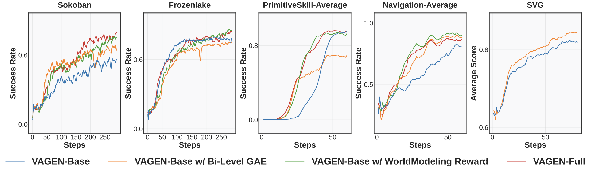
<br/>
<b>Figure 6.</b> Ablation study showing the contribution of each component.
</div>

- **WorldModeling Reward alone**: Consistently improves performance by providing visual learning signals, but limited by coarse credit assignment
- **Bi-Level GAE alone**: Notable but unstable improvements, sensitive to reward sparsity
- **VAGEN-Full (both)**: Most robust, achieving strong and stable results across all tasks

---
<!-- 
## Case Study: Qualitative Analysis

<div align="center">

<br/>
<b>Figure 7.</b> Comparison of VAGEN-Base vs VAGEN-Full reasoning quality across Navigation, Sokoban, and ManiSkill tasks.
</div>

The figure above shows side-by-side comparisons of agent reasoning. VAGEN-Full produces more accurate state descriptions and predictions, leading to better action choices.

### Emergent Reasoning Patterns

Through qualitative analysis, we observed several interesting phenomena:

1. **Task-dependent reasoning stability**: Reasoning in Navigation and ManiSkill appears stable and beneficial, while FrozenLake shows more erratic patterns

2. **Convergence to templates**: Over training, agents converge toward standardized phrasings for their reasoning, varying only the specific directional or action tokens

3. **Potential for reward hacking**: Some configurations showed agents generating reasoning-like text that satisfied the reward without genuine understanding

--- -->

## Conclusion and Limitations

We introduce a multi-turn reinforcement learning framework that rewards the reasoning process to build an internal world model through explicit visual state reasoning over **StateEstimation** (grounding) and **TransitionModeling** (prediction). In this way, the VLM agent learns to explore the environment to understand its causal/transition dynamics, and update internal beliefs as multi-turn interactions unfold.

To optimize an agent's world model reasoning, we propose **WorldModeling Reward** for dense turn-level feedback that evaluates the accuracy of the agent's internal state simulation against ground-truth. To solve the critical challenge of long-horizon credit assignment, we propose **Bi-Level GAE** that first computes the value of an entire turn's reasoning before propagating that credit precisely to individual tokens.

Our VAGEN framework significantly enhances task performance and visual reasoning quality for VLMs in agentic tasks. Limitations include restricted model architecture and evaluation environments. Future work will explore additional VLM families and unified multi-modal models for image-based world modeling.

---

## Resources

- **Paper**: [arXiv](https://arxiv.org/abs/2510.16907)
- **Code**: [GitHub](https://github.com/RAGEN-AI/VAGEN)
- **Project Page**: [https://vagen-ai.github.io/](https://vagen-ai.github.io/)
